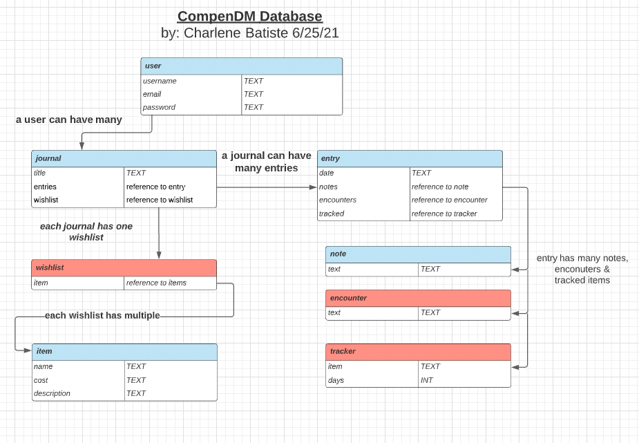

# CompendDM 

## Table of Contents
* [General Info](#general-info)
* [User Stories](#user-stories)
* [Process Work](#process-work)
* [Tech Stack](#tech-stack)
* [Set Up](#set-up)
* [Status](#status)

## General Info
CompenDM is a django app to take the place of pen and paper campaign journals. It's goal is to let users add notes to their journal for each campaign session, mark down monster and NPC encounters, track magic item usage and even add items to a specific players wishlist.

## User Stories
* As a User I want to keep notes of each campaign session.
* As a User I wants to add cool items that I want to someday have to a wishlist.
* As a User I want to keep track of monster/NPC encounters.
* As a User I want to keep track of how many days before they can use a magic item again.

## Process Work
1. Established data needs for backend.
2. Set up front end and back end applications in django and built basic Journal class. Migrated Journal class to test conection between front and backend.
3. Set up login, signup and logout views, templates and urls for user so a user can start creating Journals.
4. Created protected views to all CRUD functions for Journal. Set up urls and templates.

### ERD for data needs

## Tech Stack
- django

## Set Up
1. Fork and Clone this respository to your local machine
2. Install dependencies and set up your database.
3. Make migrations and migrate models to django backend
4. Open the directory in your text editor of choice to view.

## Status
In Progress 👩🏽‍💻