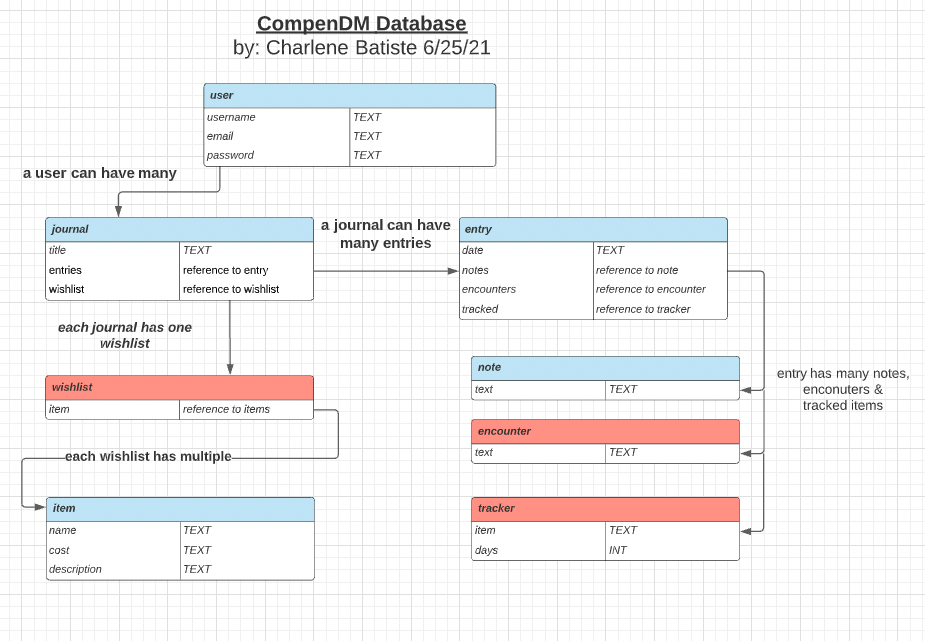

# CompendDM 

## Table of Contents
* [General Info](#general-info) ℹ️
* [User Stories](#user-stories) ❔
* [Process Work](#process-work) 🤔
* [Known Issues](#known-issues) 🧐
* [Tech Stack](#tech-stack) 📚
* [Set Up](#set-up) 🎬
* [Status](#status) ⌛️


## General Info
CompenDM is a django app to take the place of pen and paper campaign journals. It's goal is to let users add notes to their journal for each campaign session, mark down monster and NPC encounters, track magic item usage and even add items to a specific players wishlist.

## User Stories
* As a User I want to keep notes of each campaign session.
* As a User I wants to add cool items that I want to someday have to a wishlist.
* As a User I want to keep track of monster/NPC encounters.
* As a User I want to keep track of how many days before they can use a magic item again.

## Process Work
1. Established data needs for backend.
2. Set up front end and back end applications in django and built basic Journal class. Migrated Journal class to test conection between front and backend.
3. Set up login, signup and logout views, templates and urls for user so a user can start creating Journals.
4. Created protected views to all CRUD functions for Journal and Entry models. Set up urls and templates. Tested Journal CRUD and routes.
5. Added Note model, urls, views and template. Tested CRUD routes.
6. Refactored create forms for Entry and Note models to pass id of association down so users don't have to search for their entry/note on forms; it autofills.
7. Styled
8. Updated redirects*** still needs to be done

### ERD for data needs


## Known Issues
Although associations were made on the building of each model, django forms, when using the django Create/Edit/DeleteModel templates, have no idea which user is using them or which associated model the current model's form belongs to. On testing that meant every time a user wanted to add an entry to a journal or add a note to an entry they were required to look through a dropdown (that contained every journal or entry in the database), and select the corresponding Model in order to submit a form. Not only was that incredibly cumbersome to the user it also opened up private user data to any logged in user. 

The resolution was creating my own forms, which included the associated model in the url and passing that into the form as a hidden field so the user didn't have to search the database for it. The data from that form was then passed through an association function that parsed through the data, refactored it into key/value pairs and then set that data into the newly created model before saving it to the database.

### Code Snippet
```python
# FUNCTION TO PARSE FORM DATA

def parse_data(data):
    product = {}
    if 'csrfmiddlewaretoken' in data[0]:
        product['csrfmiddlewaretoken'] = data[0].split('=')[1]
        data.pop(0)
    for item in data:
        print('( item )', item)

        if '+' in item:
            new_key = item.split('=')[0]
            words = item.split('=')[1].split('+')
            new_words = (' ').join(words)
            product[new_key] = new_words
        else:
            new_key = item.split('=')[0]
            new_value = item.split('=')[1]
            product[new_key] = new_value

    return product

# Create Entry View

def entry_create(request, journal_id):
    journal = Journal.objects.get(id=journal_id)
    user = request.user

    return render(request, 'createEntry.html', { 'journal': journal, 'user': user })

# FUNCTION TO CREATE ASSOCIATION BETWEEN JOURNA AND ENTRY MODELS
def assoc_journal_entry(request):
    split_form_data = str(request.body).split('&')
    x = parse_data(split_form_data)
    new_journal = int(x.get('journal').split("'")[0]) 
    x['journal'] = new_journal

    e = Entry(
        name=x.get('name'),
        date=x.get('date'),
        journal_id=x.get('journal')
    )
    e.save()

    return HttpResponseRedirect('/journals/' + str(new_journal))
```

## Tech Stack
- django
- Bootstrap v5.0

## Set Up
1. Fork and Clone this respository to your local machine
2. Set up your backend database.
3. Make migrations and migrate models to django backend.
4. Open the directory in your text editor of choice to view.

## Status
In Progress 👩🏽‍💻